# Batmobile Companion App

Batmobile is the companion application of the Data-Driven project:
- [g0thier/datadriven](https://github.com/g0thier/datadriven)

## Description

This repository represents the mobile-oriented companion layer of the Data-Driven management ecosystem.  
It starts with the **Motivation** module inside the Human Resources management domain.

In this context, motivation is treated as a strategic lever for:
- employee retention,
- retention of organizational know-how and knowledge,
- and the first step in building robust company objectives across support functions, key success factors, marketing mix, and finance.

The current codebase is in an Angular starter phase while the product foundation is being structured.

## Table of Contents

- [Batmobile Companion App](#batmobile-companion-app)
  - [Description](#description)
  - [Table of Contents](#table-of-contents)
  - [Objective](#objective)
  - [Target Audience](#target-audience)
  - [Current Modules](#current-modules)
  - [Screenshots](#screenshots)
    - [Navigation and Flow](#navigation-and-flow)
    - [Quiz Launches](#quiz-launches)
  - [Repository Structure](#repository-structure)
  - [Installation](#installation)
  - [Available Scripts](#available-scripts)
  - [Roadmap](#roadmap)
  - [Security](#security)
  - [Changelog](#changelog)
  - [Contributing](#contributing)
  - [License](#license)
  - [Author](#author)

## Objective

Provide the companion-app foundation for Data-Driven modules, beginning with HR motivation workflows that strengthen long-term organizational performance.

## Target Audience

- Employees working under C-level leaders using the Data-Driven SaaS
- HR and people operations teams supporting C-level strategy execution
- Managers responsible for employee engagement and capability development

## Current Modules

- `Motivation`: first module focused on motivation dynamics as a retention and strategic alignment driver

## Screenshots

Here are a few previews of the application's main flow, from navigation to launching a quiz.

### Navigation and Flow

<table style="width: 100%; table-layout: fixed;">
  <tr>
    <th>Quiz</th>
    <th>Success</th>
    <th>History</th>
    <th>Profile</th>
  </tr>
  <tr>
    <td align="center">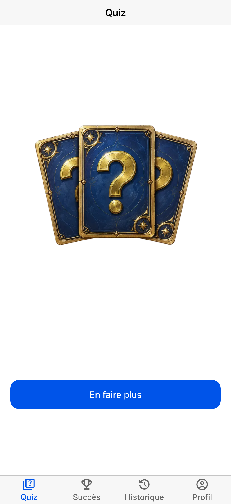</td>
    <td align="center">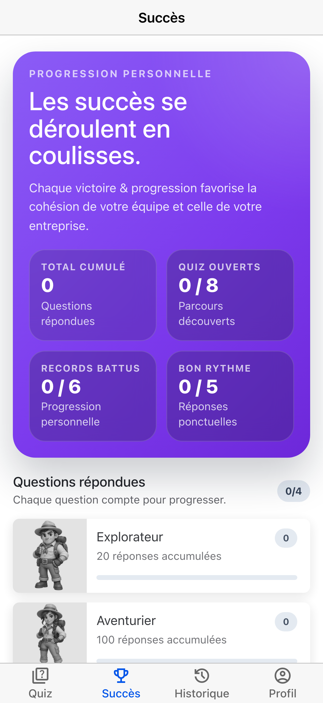</td>
    <td align="center">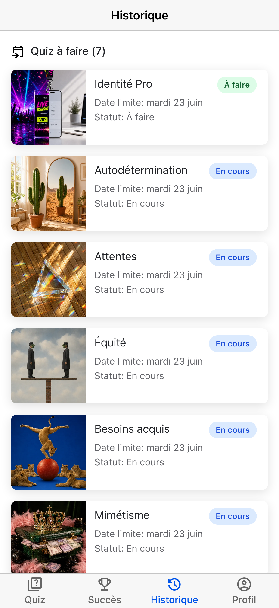</td>
    <td align="center">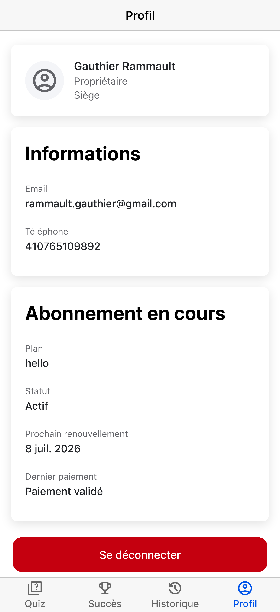</td>
  </tr>
</table>

### Quiz Launches

These screenshots show examples of sessions opened from history, with several quizzes related to the Motivation module.

<table style="width: 100%; table-layout: fixed;">
  <tr>
    <th>Attentes</th>
    <th>Autonomy</th>
    <th>Acquired Needs</th>
    <th>Equity</th>
  </tr>
  <tr>
    <td align="center">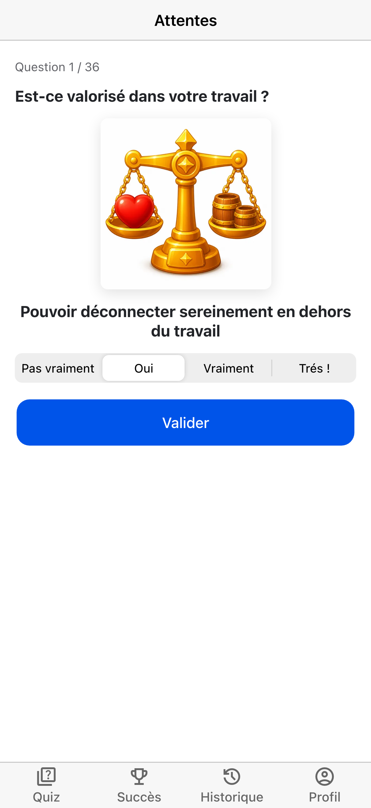</td>
    <td align="center">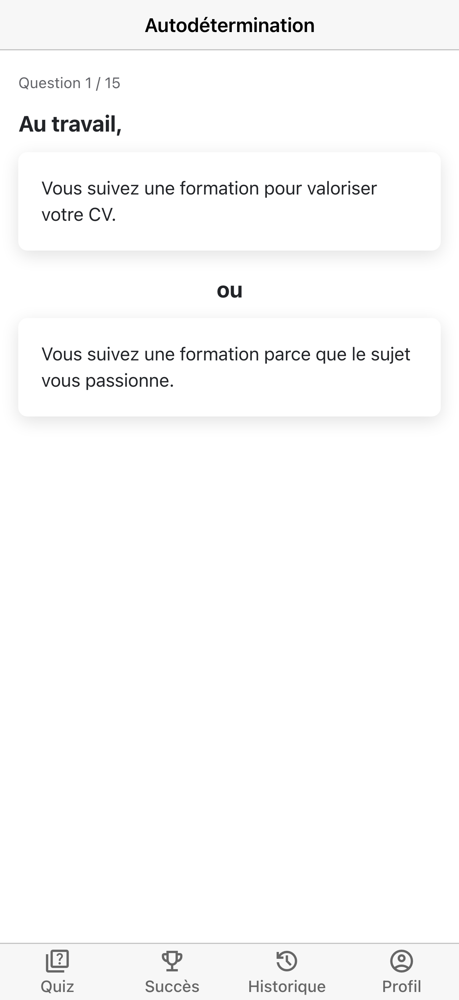</td>
    <td align="center">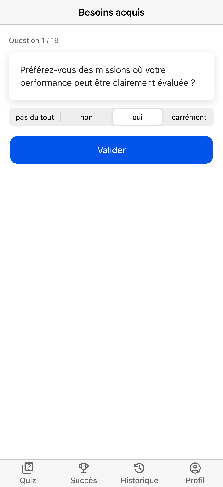</td>
    <td align="center">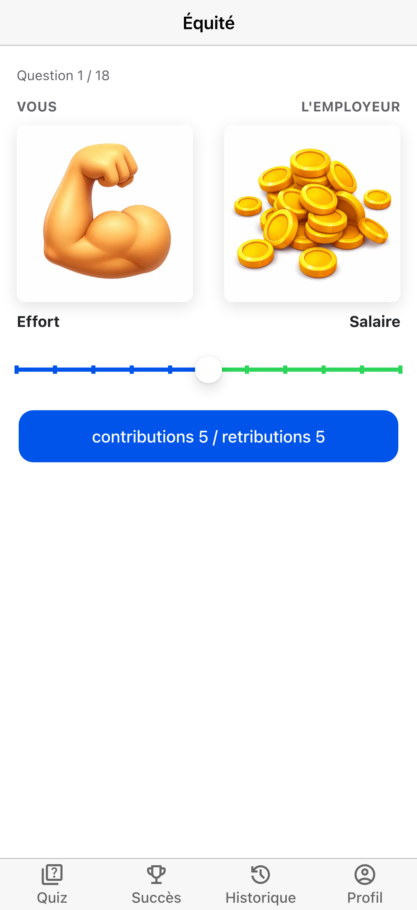</td>
  </tr>
  <tr>
    <th>Professional Identity</th>
    <th>Mimicry</th>
    <th>Needs Pyramid</th>
    <th>Theory X/Y</th>
  </tr>
  <tr>
    <td align="center">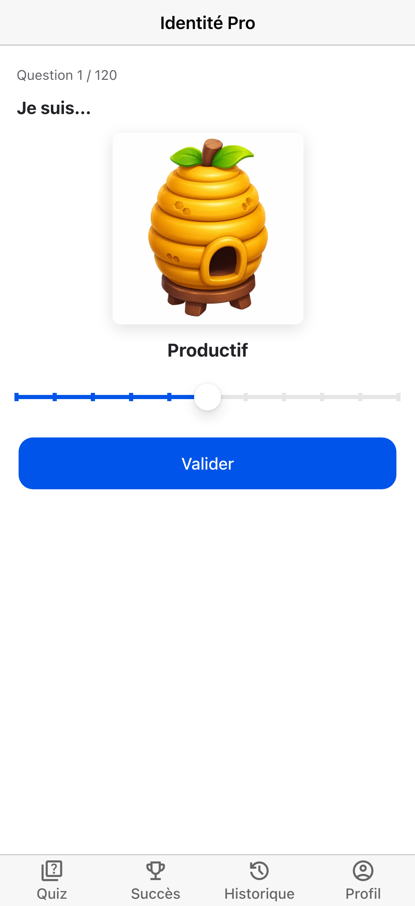</td>
    <td align="center">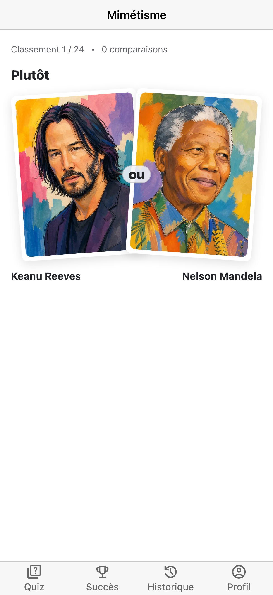</td>
    <td align="center">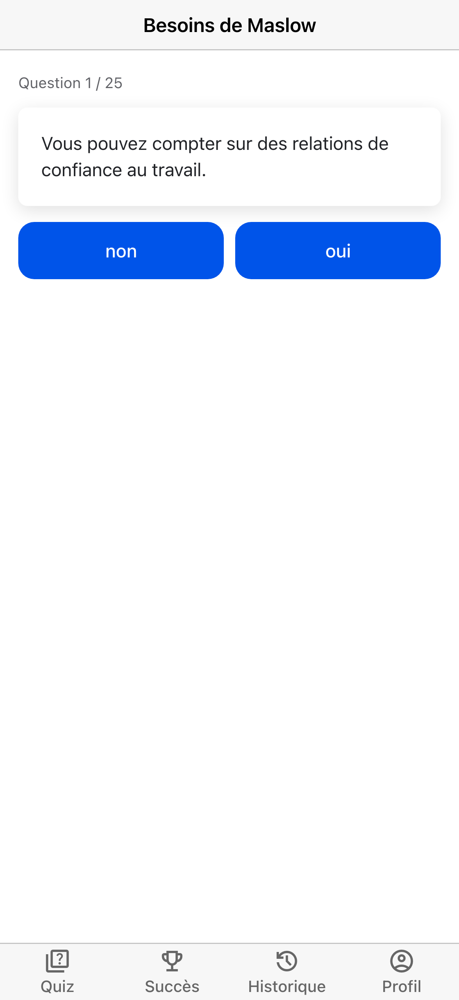</td>
    <td align="center">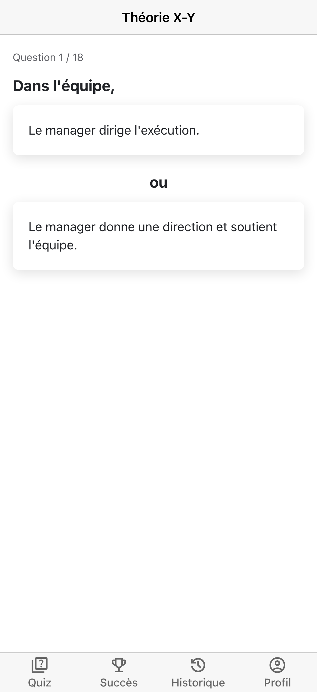</td>
  </tr>
</table>

## Repository Structure

```text
batmobile/
├── public/
│   └── favicon.ico
├── src/
│   ├── app/
│   │   ├── app.config.ts
│   │   ├── app.css
│   │   ├── app.html
│   │   ├── app.routes.ts
│   │   ├── app.spec.ts
│   │   └── app.ts
│   ├── index.html
│   ├── main.ts
│   └── styles.css
├── angular.json
├── package.json
└── README.md
```

## Installation

Install dependencies:

```bash
npm install
```

Start the development server:

```bash
npm run start
```

## Available Scripts

```bash
npm run ng            # Run the Angular CLI directly
npm run start         # Start the Angular dev server
npm run startdocs     # Start the docs site
npm run images        # Optimize image assets
npm run icons         # Generate app icons
npm run favicon       # Generate the favicon
npm run screenshots   # Capture Angular pages into docs/images
npm run assets        # Build optimized images, favicon, and icons
npm run imagesnbuild  # Optimize images and build the app
npm run build         # Build production assets
npm run watch         # Build in watch mode for development
npm run test          # Run unit tests
```

The screenshot script uses Playwright and expects login credentials when capturing protected
pages. You can provide them through `.env.local` or shell variables such as:

```bash
SCREENSHOT_AUTH_EMAIL=you@example.com
SCREENSHOT_AUTH_PASSWORD=your-password
```

Before the first run, install the Chromium browser used by Playwright:

```bash
npx playwright install chromium
```

## Roadmap

The roadmap follows the MBA / RNCP curriculum and aims to build one data-driven tool for each major block of competencies.

- `Strategic Orientation`: data tools for strategy definition, dashboards, and business alignment
- `Financial Strategy`: data tools to track finance, governance, and performance indicators
- `Marketing & Commercial Strategy`: data tools to support segmentation, offers, and commercial execution
- `Team Management`: data tools to support leadership, HR management, and team performance
  - `Motivation` (current): HR motivation and retention foundation
- `Digital Project`: data tools to support digital transformation, innovation, and project delivery

## Security

Security reporting process is documented in [SECURITY.md](SECURITY.md).

## Changelog

Project changes are tracked in [CHANGELOG.md](CHANGELOG.md).

## Contributing

Contributions are welcome. Start with [CONTRIBUTING.md](CONTRIBUTING.md) and [CODE_OF_CONDUCT.md](CODE_OF_CONDUCT.md).

## License

License details are available in [LICENSE.md](LICENSE.md).

## Author

Gauthier Rammault
